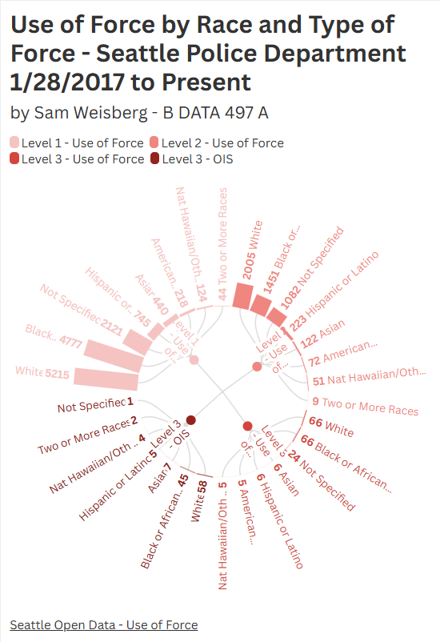

This is my visualization for Flourish 2, it is a radial hierarchy of data from the Seattle Police Department (sourced from Seattle Open Data)
The data being shown is "use of force" data, it is broken into four categories, level 1, level 2, level 3, and level 3 OIS (Officer involved shooting)
I chose this dataset and visualization because it highlights the inneffective nature of the data for multiple reasons. It is unclear what the data actually means.
The levels of force are not explained, and there being two 3rd levels makes the data even more confusing. I had to figure out through other sources what OIS meant.
Additionally there is a race category called "two or more races" without any further data, not particularly useful. The visualization would make the data more useful
if the data was normalized in proportion to the population of Seattle to highlight inequality.
